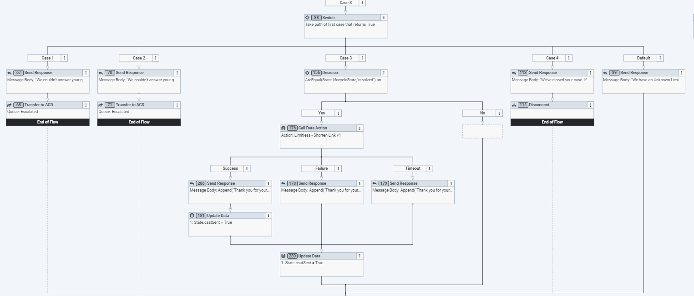

## Implementing a support platform that delivers exceptional customer experience

This Genesys Cloud Developer Blueprint provides a simple example of implementing [Limitless GigCX](https://www.limitlesstech.com/genesys/ "Goes to the GigCX with Limitless and Genesys page") on Genesys Cloud to manage and deliver expert customer support.

## Solution components

1. **Limitless GigCX** - A product your organization can use to quickly build a qualifier crowd of exports to resolve customer support tickets. The expert is available 24/7, in any language, to deliver support and lower cost. You can find out more about Limitless GigCX [here](https://www.limitlesstech.com/).

2. **Genesys Cloud Architect Flows** - A drag and drop web-based design tool that dictates how Genesys Cloud handles inbound or outbound interactions. 

3. **Genesys Cloud Data Actions** - A Genesys Cloud integration capability that allows Genesys Architect Flows to integrate third-party REST APIs and/or AWS Lambdas . 

## Prerequisites

### Specialized knowledge

- Experience with Limitless GigCX
- Experience designing Architect flows
- Experience importing and/or designing Genesys Cloud Data Actions
- Experience configuring and installing Genesys Cloud web chat v1.1 or Genesys Cloud v2

The following diagram shows a high-level representation of the implementation.

 

You can learn more about Limitless GigCX and Genesys [here](https://www.limitlesstech.com/genesys/ "Goes to the GigCX with Limitless and Genesys page").

# Implementation steps

## Connecting to Limitless GigCX SmartCrowd

Without connectivity to Limitless GigCX SmartCrowd, you cannot bring Experts into the conversation. The expert crowd uses the SmartCrowd platform to receive conversations and respond to them. The expert can do this process via Web or Mobile App, and they receive rewards on a per task basis. Limitless GigCX operates a fully managed service for the expert crowd, so a Limitless GigCX client is required to connect to the platform and route tasks. This blueprint shows you how to achieve that for Genesys Cloud.

Steps to connectivity:

1. To request a demo, contact [Limitless GigCX](https://www.limitlesstech.com/request-a-demo/ "Goes to the See Limitless GigCX in action page").

2. The Limitless GigCX team provides the following:
   - Your API Key (x-api-key)
   - The Group Name for your implementation
   - User Credentials so you can play the role of an expert in your Group on the SmartCrowd platform

The API key and Group Name are passed through to SmartCrowd via Data Actions, and these values enable you to submit questions and customer dialogues to Limitless GigCX.

## The data actions

We use Data Actions to call the Limitless GigCX APIs. There are 12 data actions saved in this blueprint under the "Data Actions" subdirectory. Before importing the Data Actions, be sure to have both "Web Services Data Actions" integration and the “Genesys Cloud Data Actions” installed and made active. For more information see, [About the web services data actions integration](https://help.mypurecloud.com/?p=127163 "Goes to the About the web services data actions integration article") in the Genesys Cloud Resource Center.

Now we import each of the 12 data actions. For more information see, [Import or export a data action for integrations](https://help.mypurecloud.c}om/?p=161024 "Goes to the Import or export a data action for integrations article") in the Genesys Cloud Resource Center.

Each data action connects to an API - some are Genesys Cloud APIs, and some are Limitless GigCX Web Services, as shown in the table below.

The following are data actions to import:

|**Data Action Name**|**Integration**|**Used In**|**Purpose**|
| :- | :- | :- | :- |
|[Get Contact By Phone from Genesys v1](https://github.com/GenesysCloudBlueprints/limitless-flows-blueprint/tree/main/blueprint/DataActions/Limitless---Get-Last-N-Message-Ids-from-Genesys-v1-2021062184303.custom.json)|Genesys Cloud|Open messaging flow|Looks up the customer in the Genesys External Contacts using the phone number. Returns the customers' first name and initial of their last name (this is used for personalization of responses) Note: In your contact center, you may use a CRM for this information and use your CRM API to get the customer details)|
|[Get Message Id Count from Genesys v1](https://github.com/GenesysCloudBlueprints/limitless-flows-blueprint/tree/main/blueprint/DataActions/Limitless---Get-Message-Id-Count-from-Genesys-v1-2021062184247.custom.json)|Genesys Cloud| Open messaging flow - Chat flow|Counts the number of messages authored by the customer for this Genesys Conversation. Used in logic to send more customer dialogues to Limitless|
|[Get Last N Message Ids from Genesys v1](https://github.com/GenesysCloudBlueprints/limitless-flows-blueprint/tree/main/blueprint/DataActions/Limitless---Get-Last-N-Message-Ids-from-Genesys-v1-2021062184303.custom.json)|Genesys Cloud|Open messaging flow|Returns the last N message ids of messages authored by the customer on this Genesys Conversation. Used in logic to send other customer dialogues to Limitless|
|[Get Last Message from Genesys v1](https://github.com/GenesysCloudBlueprints/limitless-flows-blueprint/tree/main/blueprint/DataActions/Limitless---Get-Last-Message-from-Genesys-v1-2021062184312.custom.json)|Genesys Cloud|Open messaging flow|Returns the customer authored dialogue (e.g. message body) for a specific message so it can be sent to Limitless|
|[Get Message Ids From Chat Conv By Id from Genesys v1](https://github.com/GenesysCloudBlueprints/limitless-flows-blueprint/tree/main/blueprint/DataActions/Limitless---Get-Message-Ids-From-Chat-Conv-By-Id-from-Genesys-v1-20210721153255.custom.json)|Genesys Cloud|Chat flow|Get any new message ids from the chat, oldest first|
|[Get Message Ids From Chat Conv By Id And MsgId from Genesys v1](https://github.com/GenesysCloudBlueprints/tree/main/limitless-flows-blueprint/blueprint/DataActions/Limitless---Get-Message-Ids-From-Chat-Conv-By-Id-And-MsgId-from-Genesys-v1-20210721153212.custom.json)|Genesys Cloud|Chat flow|Also searches with messageId|
|[Push Question to SmartCrowd v1](https://github.com/GenesysCloudBlueprints/limitless-flows-blueprint/tree/main/blueprint/DataActions/Limitless---Push-Question-to-SmartCrowd-v1-2021062184324.custom.json)|Web Services| Open messaging flow - Email flow- Chat flow |Submits the question/conversation to Limitless.|
|[Submit FollowUp Dialogue to SmartCrowd v1](https://github.com/GenesysCloudBlueprints/limitless-flows-blueprint/tree/main/blueprint/DataActions/Limitless---Submit-FollowUp-Dialogue-to-SmartCrowd-v1-2021062184330.custom.json)|Web Services|Open messaging flow - Email Flow - Chat flow |Submits new customer authored dialogues to Limitless.|
|[Return from SmartCrowd v1](https://github.com/GenesysCloudBlueprints/limitless-flows-blueprint/tree/main/blueprint/DataActions/Limitless---Return-from-SmartCrowd-v1-2021062184337.custom.json)|Web Services|Open messaging flow - Chat flow |Tells SmartCrowd to close its message lifecycle as Genesys has introduced an Agent into the conversation.|
|[Get Full Event from SmartCrowd v1](https://github.com/GenesysCloudBlueprints/limitless-flows-blueprint/tree/main/blueprint/DataActions/Limitless---Get-Full-Event-from-SmartCrowd-v1-2021062184345.custom.json)|Web Services|Open messaging flow - Email flow - Chat flow|Retrieves expert dialogue and SmartCrowd Message Status events from the Limitless event queue.|
|[Send Email Reply v1](https://github.com/GenesysCloudBlueprints/limitless-flows-blueprint/tree/main/blueprint/DataActions/Limitless---Send-Email-Reply-v1-20210722145321.custom.json)|Web Services|Email flow|Send the expert response via email using an SMTP server.|
|[Shorten Link v1](https://github.com/GenesysCloudBlueprints/limitless-flows-blueprint/tree/main/blueprint/DataActions/Limitless---Shorten-Link-v1-2021062184350.custom.json)|Web Services|Open messaging flow - Email flow - Chat flow |Used to call out to a 3rd Party url shortener to reduce the size of the CSAT link. The example url here is for Bitly: [Short links, big results](https://bitly.com/ "Goes to the Short links, big results page") and to use that service you need a Bitly account and then to input your account specific token into the header. You can also replace Bitly with your url shortener of choice.|

After importing all the data actions, you must publish them to be used in our Architect flows.

## The architect flows

A Genesys Cloud Architect flow is required to send a customer question (from an incoming message) to Limitless GigCX. This blueprint contains the following flows:

- [Limitless Chat Flow](https://github.com/GenesysCloudBlueprints/limitless-flows-blueprint/tree/main/blueprint/ArchitectFlows/Limitless%20Chat%20Flow%20V2.0.0_v21-0.i3InboundChatFlow "Goes to the Limitless Chat Flow") - Connect Limitless  GigCX to your web chat channels (**Note**: This flow is compatible with web chat v1.1 & web chat v2)
- [Limitless Email Flow](https://github.com/GenesysCloudBlueprints/limitless-flows-blueprint/tree/main/blueprint/ArchitectFlows/Limitless%20Email%20Flow%20v2.0.0_v34-0.i3InboundEmailFlow "Goes to the Limitless Email Flow") - Connect Limitless GigCX to your email channels 
- [Limitless Messaging Flow](https://github.com/GenesysCloudBlueprints/limitless-flows-blueprint/tree/main/blueprint/ArchitectFlows/Limitless%20Messaging%20Flow%20v2.0.0_v26-0.i3InboundMessage "Goes to the Limitless Messaging Flow") - Connect Limitless GigCX to your open messaging channels

You can import these flows from the "Architect Flows" GUI. For more information see, [Import or export a flow](https://help.mypurecloud.com/?p=2730 "Goes to the the Import or export a flow article") in the Genesys Cloud Resource Center. Architect flows can also be import by using the [Archy](/devapps/archy/ "Goes to the Welcome to Archy page") command line tool.

### Flow variables

For all flows, you must set the following flow variables. You can set these variables in the ***Resources>Data*** area of each flow. 

 

For more information see, [Manage a variable](https://help.mypurecloud.com/?p=109357 "Goes to the Manage a variable article") in the Genesys Cloud Resource Center.

|**Variable**|**Set to**|
| :-: | :-: |
|Flow.apikey|Your API key supplied by Limitless|
|Flow.stage|The target Limitless environment is being used by this flow. This value is supplied by Limitless|
|Flow.EnterpriseName|Set this value to the name of your Enterprise. This value appears in some of the Send Response blocks within the flow.|
|Flow.GroupName|Set this to the Group Name value that Limitless provided to you|
|Flow.LoopMax|Set to the maximum number of loops you want the Flow to go through (See ‘Enter The Loop’ section). The default value is 90 and you see through most implementations - consider changing this in only consultation with the Limitless team.|
|Flow.WaitSeconds| Set the wait time for the Loop you require (See ‘Enter The Loop’ section). The default value is 8 seconds and you see through most implementations - consider changing this value in only consultation with the Limitless team.|

### Flow states

Each flow has two states:

- **Starting state** - The Starting State represents a simple flow that engages Limitless GigCX by calling the Limitless GigCX expert state. Other than demos, you won’t use the Starting State because you have your own flows that you wish to extend to the expert crowd.
- **Limitless Expert** - This state contains the connectivity and conversation lifecycle management when the conversation is handled by expert crowd via the SmartCrowd platform. The logic contained in this state is described below, but only make changes in consultation with the Limitless GigCX team. This state is designed to drop the conversation into an existing Genesys flows and bring the expert crowd into the conversations.

### **The open messaging flow**

The open messaging flow connects Limitless GigCX to your open messaging channels.

#### Starting state

This state contains:

- ***A Send Response Block*** - Debugging information that confirms you are in the Limitless GigCX demo and the Genesys Message ID
- ***Switch Block***:
  - Case 1 - A simple example shows routing straight to an Agent rather than the GigCX Crowd
  - Case 2 - A simple example shows where automation/chatbot could be used
  - Case 3 - Shows routing to Limitless GigCX via the ‘Limitless Expert’ state

#### Limitless GigCX expert state

This state contains the connectivity and conversation lifecycle management when the conversation is handled by the expert crowd via the SmartCrowd platform.

##### Look up the customer
The Call Data Action is the first step in our "Limitless Expert" flow using the ‘Get Contact By Phone' action.

 

You may use a Customer Relationship Management (CRM) solution in your contact center. This block uses the customer’s phone number to retrieve the first name and initial of their last name to include in the post of the question to Limitless. The customer's first name and initial of their last name are shared and can be seen by the expert crowd to aid the personalization of the expert response. You can replace this data action with a call to your CRM to retrieve the required customer information. 

***An important note here on ‘Transfer to ACD’ blocks in the flow*** - is that an exception handling sends the conversation to an ‘Escalated’ queue via a ‘Transfer to ACD’ block. The ‘Escalated’ queue is replaced with the agent queue you want conversations to go if the ‘Limitless Expert' state hits a problem or the expert crowd cannot help the customer.

 

##### Submit the question to Limitless

There is another Call Data Action using the ‘Limitless Push Question’ action. This action submits the customer's question to the Limitless GigCX SmartCrowd platform, and it becomes visible to expert in the GigCX Crowd. In the integration, the Genesys Conversation ID and Limitless GigCX Message ID are exchanged.

 

##### Enter the loop

After successfully submitting the customer question to Limitless GigCX, the ‘Limitless Expert’ flow prepares to enter a loop. The Loop performs two functions:

1. Monitor the customer side of the conversation - detecting and submitting more customer dialogues to Limitless GigCX.
2. Monitor the Limitless side of the conversation - detecting and displaying expert dialogues to the customer while monitoring the Lifecycle state of the Limitless GigCX message within the SmartCrowd platform.

By default, the Loop executes 90 times with a wait time of 8 seconds. These values can be changed to adjust the customer experience in different messaging channels and scenarios - consider changing these values only in consultation with the Limitless GigCX team.

The flow does the following to prepare for entering the loop:

1. Attaches the Limitless GigCX Message ID to the Conversation - This flow signifies a conversation is ‘with Limitless’ GigCX. This association is removed in the flow when the Limitless GigCX portion of the conversation is over.
2. Sets the customer message count to 1, which signify the submitted question, and the value is used within the loop to decide if more customer dialogues must send to Limitless GigCX.

 

##### The loop

At the start of each loop, the number of customer dialogues on the conversation is compared with the previous number at the start of the last loop. The following action is performed: Get Message ID Count and the subsequent decision block.

 

If the number is now greater than the saved number, the loop moves to the customer Dialogue part to pick up and send  the other customer dialogues to Limitless GigCX.

If the number is not greater than the saved number, the loop moves to the Limitless GigCX part to pick up and send the expert dialogues. The message status is monitored within SmartCrowd, so the appropriate actions are taken within the conversation.

The Wait block is executed if the customer or the expert does not present dialogue. This Wait keeps the loop from “running away” and reaching the LoopMax count too quickly. A smaller value in the WaitSeconds flow variable can make the whole experience more responsive. However, too small of a WaitSeconds value causes the entire loop to complete too soon. Consult with the Limitless GigCX team before altering these default values.

##### Customer dialogue side of the loop

This part of the Loop picks up more customer dialogues to send to Limitless GigCX. It picks up the number of customer dialogues authored since the last send to Limitless. It then loops through them, submitting each one to Limitless GigCX via the ‘Limitless Submit Follow Up Dialogue’ Data Action.

You would consider the logic if the customer includes the word "Agent," the loop uses a ‘Transfer to ACD’ block immediately to bring in an agent. The agent is introduced into the conversation if the 'Transfer to ACD' block is triggered. The Flow informs Limitless GigCX SmartCrowd via the 'Limitless Return' Data Action. This action ensures the conversation is closed on the Limitless GigCX side and removed from the expert.

 

##### Limitless side of the loop

This part of the Loop monitors a Limitless GigCX event queue for expert dialogues and Limitless GigCX status events that must trigger specific actions in the conversation. This part of the Loop starts with retrieving the events from the queue via the ‘Limitless Get Full Event Prod’ Data Action. 

 

The subsequent Event Type block evaluates the following cases:

- ***Case 1*** - An expert dialogue event detects via the Limitless GigCX update type = ‘dlg’. The expert dialogue submits to the customer via a Send Response block.

- ***Case 2*** - The expert expressed the conversation is complete and the event detects the Limitless GigCX update type = ‘cust\_confirmation’. If a CSAT is not sent, then this event triggers a CSAT link (shortened via a data action) sent to the customer. 

- ***Case 3*** - A Limitless GigCX SmartCrowd status change event detects via the Limitless GigCX update type = ‘state’. These status changes are evaluated, and the following actions must be performed:
  - ***‘Escalated’*** - The expert crowd has decided they cannot resolve this question. This state detects that the customer receives a message that an agent is introduced into the conversation, and a ‘Transfer to ACD’ block brings in the agent.
  - ***‘TimedOut’*** - The expert crowd did not respond in time. This state detects that the customer receives a message that an agent is introduced into the conversation, and a ‘Transfer to ACD’ block brings in the agent.
  - ***‘Open’ & Not ‘TimedOut’*** - The Limitless GigCX lifecycle is in a state where a CSAT, if not already issued, must be sent to the customer. The flow actions this response.
  - ***‘Resolved’*** - The Limitless GigCX lifecycle is complete, and the question resolved. This action is an end state, and the flow disconnects. 

### The chat flow

This connects Limitless GigCX to your web chat channels (note: This flow is compatible with web chat v1.1 & web chat v2)

#### Starting state

This state begins by welcoming the customer and ensuring there is a customer message to acknowledge. 

 

Once established, the customers chat is routed to Limitless GigCX via a switch block:

- Case 1 - Shows example routing straight to an Agent rather than the GigCX Crowd
- Case 2 - Shows an example where automation/chatbot might be used
- Case 3 - Shows example routing to Limitless GigCX via the ‘Limitless Expert’ state

#### Limitless expert state

This state contains the connectivity and conversation lifecycle management when an expert crowd handles the conversation via the SmartCrowd platform.

#### Submit the question to Limitless GigCX

A Call Data Action is using the ‘Limitless Push Question’ action. This action submits the customer’s question to the Limitless GigCX SmartCrowd platform, and it becomes visible to the expert in the GigCX Crowd. The Genesys Conversation ID and Limitless GigCX Message ID are exchanged in the integration.

 

#### Enter The loop

After successfully submitting the customer question, the ‘Limitless Expert’ flow prepares to enter a loop. The Loop performs two functions:

1. Monitors the customer side of the conversation - detecting and submitting more customer dialogues to Limitless GigCX.
2. MonitorS the Limitless GigCX side of the conversation - detecting and displaying expert dialogues to the customer and monitoring the Lifecycle state of the Limitless GigCX message within the SmartCrowd platform, and taking appropriate action based on these statuses. 

By default, the Loop executes 90 times with a wait time of 8 seconds. These values can be changed to adjust the customer experience in different messaging channels and scenarios - consider changing these values only when consulted with the Limitless GigCX team.

The flow does the following to prepare for entering the loop:

1. Attaches the Limitless GigCX Message ID to the Conversation - This signifies a conversation is ‘with Limitless’, and this association is removed in the flow when the Limitless GigCX portion of the conversation is over.
2. Sets the customer message count to 1, which signify the submitted question, and the value is used within the loop to decide if more customer dialogues must be sent to Limitless GigCX.

#### The loop

During the loop's initial start, the number of customer dialogues on the conversation is compared to the last number at the beginning of the previous loop. The following action is performed: Get Message ID Count and the subsequent Decision block.

If the number is now greater than the saved number, the loop moves to the customer dialogue part to pick up and send the other customer dialogues to Limitless GigCX.

If the number is not greater than the saved number, the loop moves to the Limitless GigCX part to pick up and send the expert dialogues. The message status is monitored within SmartCrowd, so the appropriate actions are taken within the conversation.

If the customer nor the expert presents dialogue, then the Wait block is executed. The Wait block keeps the loop from “running away” and reaching the LoopMax count too quickly. A smaller value in the WaitSeconds flow variable can make the whole experience more responsive.  However, too small of a WaitSeconds value causes the entire loop to complete too soon.  Consult with the Limitless GigCX team before altering these default values.

 

##### Customer dialogue side of the loop

The customer dialogue picks up other customer dialogues authored since the last delivery to Limitless GigCX. The loops then submit each to Limitless GigCX via the ‘Limitless Submit Follow Up Dialogue’ Data Action.

If the customer includes the word “Agent”, then the loop uses a ‘Transfer to ACD” block immediately to bring in an agent. Consider the logic; if the ‘Transfer to ACD’ block is triggered, and the agent is introduced into the conversation, then the flow informs Limitless GigCX SmartCrowd via the 'Limitless GigCX Return’ data action. This ensures that the conversation is closed on the Limitless GigCX side and removed from the expert.

 

##### Limitless side of the loop

The Limitless side of the loop monitors a Limitless GigCX event queue for expert dialogues and Limitless GigCX status events that must trigger specific actions in the conversation. This part of the Loop starts with retrieving the events from the queue via the ‘Limitless Get Full Event Prod’ Data Action. 

 

Then, the subsequent event Type block evaluates the following cases:

- ***Case 1*** - An expert dialogue event detects the Limitless GigCX update type = ‘dlg’. he customer receives The expert dialogue via a Send Response block.

- ***Case 2*** - The expert has expressed that they believe the conversation is complete, and this event detects the Limitless GigCX update type = ‘cust\_confirmation’. If a CSAT is not sent, the event triggers a CSAT link (shortened via a data action) to send to the customer.

- ***Case 3*** - A Limitless GigCX SmartCrowd status change event detects the Limitless GigCX update type = ‘state’. These status changes are evaluated, and the following actions must be performed:
  - ***‘Escalated’*** - The expert crowd has decided they cannot resolve this question. This state detects that the customer receives a message that an agent is introduced into the conversation, and a ‘Transfer to ACD’ block brings in the agent.
  - ***‘TimedOut’*** - The expert crowd did not respond in time. This state detects that the customer receives a message that an agent is introduced into the conversation, and a ‘Transfer to ACD’ block brings in the agent.
  - ***‘Open’ & Not ‘TimedOut’*** - If not already issued, the Limitless GigCX lifecycle is in a state where a CSAT, must be sent to the customer. This is part of the action of the flow.
  - ***‘Resolved’*** - The Limitless GigCX lifecycle was completed, and the question was resolved. This is an end state, and the flow disconnects.

### The email flow

The email flow connects Limitless GigCX to your email channels. 

#### Starting state

The Starting state contains:
- ***A Send Response Block*** - Debugging information confirming you are in the Limitless GigCX demo and the Genesys Message ID
- ***Switch***:
  - ***Case 1*** - Shows routing straight to an agent rather than the GigCX Crowd
  - ***Case 2*** - Shows where automation/chatbot could be used (Self help)
  - ***Case 3*** - Sends a follow-up message via the data action and the customer replies to the thread

- ***Default*** - Routes the original question to the expert. This part contains a Call Data Action using the ‘Limitless Push Question’. The action submits the customer’s question to the Limitless GigCX SmartCrowd platform, and it becomes visible to the expert in the GigCX Crowd. The Genesys Conversation ID and Limitless GigCX
Message ID are exchanged in the integration.

#### Limitless GigCX expert state

The Expert state contains the connectivity and conversation lifecycle management when the conversation is handled by expert Crowd via the SmartCrowd platform.

#### Enter The loop
After successfully submitting the customer question to Limitless GigCX, the ‘Limitless Expert’ flow prepares to enter a loop. The Loop performs one function, to monitor the Limitless GigCX side of the conversation - detecting and displaying expert dialogues to the customer and monitoring the Lifecycle state of the Limitless GigCX message within the SmartCrowd platform and taking the appropriate action based on these statuses.

 

By default, the loop executes 90 times with a wait time of 8 seconds. These values can be changed to adjust the customer experience in different email channels and scenarios - consider changing these values only in consultation with the Limitless GigCX team.

To prepare for entering the loop, the flow attaches the Limitless GigCX Message ID to the Conversation - This is used to signify a conversation is ‘with Limitless’, and this association is removed in the flow when the Limitless GigCX portion of the conversation is over.

#### The loop

The loop picks up and sends expert dialogues and monitors the message's status within SmartCrowd so the appropriate actions are taken within the conversation.

If the expert presents a dialogue, then the Wait block is executed. This Wait keeps the loop from “running away” and reaching the LoopMax count too quickly. A smaller value in the WaitSeconds flow variable can make the whole experience more responsive. However, too small of a WaitSeconds value causes the entire loop to complete too soon. Consult with the Limitless GigCX team before altering these default values.

##### Monitoring Limitless

Monitoring Limitless observes the Limitless GigCX event queue for expert dialogues and Limitless GigCX status events required to trigger specific actions in the conversation. This part of the Loop starts with retrieving the events from the queue via the ‘Limitless GigCX Get Full Event Prod’ Data Action. The subsequent Event Type block then evaluates the following cases:

- ***Case 1*** - An expert dialogue event detects the Limitless GigCX update type = ‘dlg’. The customer receives The expert dialogue via a Send Response block.

- ***Case 2*** - The expert has expressed an opinion they believe that the conversation is complete and this event detects via the Limitless GigCX update type = ‘cust\_confirmation’. If a CSAT is not sent, then this event triggers a CSAT link (shortened via a data action), which sends the action to the customer.

- ***Case 3*** - A Limitless GigCX SmartCrowd status change event detects via the Limitless GigCX update type = ‘state’. These status changes are evaluated, and the following actions must be performed:
  - ***‘Escalated’*** - The expert crowd has decided they cannot resolve the question. This state detects that the customer receives a message that an agent is introduced into the conversation, and a ‘Transfer to ACD’ block brings in the agent.
  - ***‘TimedOut’*** - The expert crowd did not respond in time. This state detects that the customer receives a message that an agent is introduced into the conversation, and a ‘Transfer to ACD’ block brings in the agent.
  - ***‘Open’ & Not ‘TimedOut’*** - If not already issued, the Limitless GigCX lifecycle is in a state where a CSAT, must be sent to the customer. The flow actions this response.
  - ***‘Resolved’*** - The Limitless GigCX lifecycle is complete, and the question is resolved. This is an end state and the flow disconnects.

:::primary
The use of the Limitless GigCX flows has no impact on Cloud Analytics or reporting.
:::

## Other considerations

- ***Flow Outcomes*** - The blueprint does not contain flow Outcomes to avoid validation errors on import. Consider what Flow Outcomes you want and introduce these to Flow.

## Additional resources

- [APIs Developer Center page](/api/ "Goes to the APIs page") in the Genesys Cloud Developer Center
- [Limitless GigCX blueprint repository](https://github.com/GenesysCloudBlueprints/limitless-flows-blueprint "Goes to the Limitless blueprint repository") in Github
- [Import or export a data action for integrations](https://help.mypurecloud.com/?p=161024 "Goes to the Import or export a data action for integrations article") in the Genesys Cloud Resource Center
- [Import or export a flow](https://help.mypurecloud.com/?p=2730 "Goes to the Import or export a flow article") in the Genesys Cloud Resource Center
- [Import or export a flow using Archy]() in the Genesys Cloud Developer Center.
