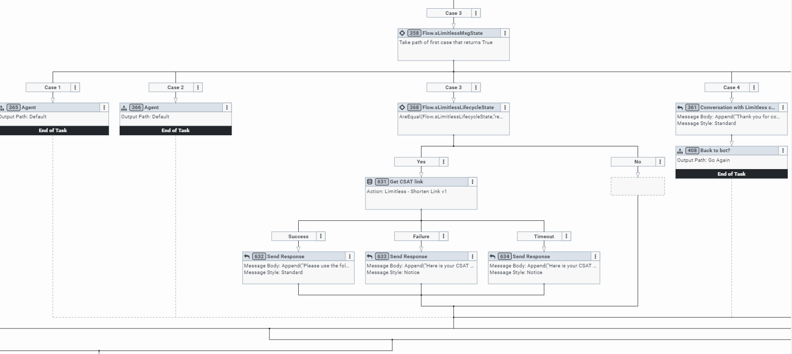

## **Introduction**
Welcome to the wonderful world of Gig Customer Service – also known as GigCX! This blueprint contains all the components you need to implement Limitless GigCX into your Genesys Cloud organization.

This blueprint will cover the flowing areas:

- Limitless GigCX
- Connecting To Limitless SmartCrowd
- The Data Actions
- The Architect Flows:
  - Open messaging
  - Chat (This flow is compatible with web chat v1.1 & web chat v2)
  - Email
- Additional Considerations
## **Limitless GigCX**
Via Limitless GigCX your organization can quickly build a qualified crowd of expert product users to resolve customer support tickets. Experts are available 24/7, in any language, to deliver amazing support at a significantly lower cost to serve. You can find out more about Limitless and GigCX at: <https://www.limitlesstech.com/>

This blueprint brings the power of Limitless and GigCX to Genesys Cloud architect flows. Using these flows, open messaging, chat and email channels in Genesys Cloud can be connected to Limitless APIs to bring GigCX Experts into the conversation via the SmartCrowd platform. 

The flow performs the following functions:

- Routing of conversations to Expert Crowd
- Integration between Genesys Cloud and the Limitless SmartCrowd platform
- Facilitating the conversation between Customer and GigCX Expert
- Manages the lifecycle/status events coming from the SmartCrowd platform and routes accordingly within Genesys
- Brings a Genesys Agent into the conversation if the Expert Crowd is unable to help the Customer

A high-level representation of the implementation can be seen in the diagram.

 

You can learn more about Limitless and Genesys at: <https://www.limitlesstech.com/genesys/>

## **Connecting to Limitless SmartCrowd**

This is the first step. Without connectivity to Limitless SmartCrowd you cannot bring Experts into the conversation. The Expert Crowd use the SmartCrowd platform to receive conversations and respond to them. Experts can do this via Web or Mobile App and they receive rewards on a per task basis. Limitless operates a fully managed service for the Expert Crowd so all that is required is for a Limitless Client to connect to the platform and route tasks. This blueprint shows you how to achieve that for Genesys Cloud.

Steps to connectivity:

1. Contact Limitless and our friendly team. Contact Limitless here: <https://www.limitlesstech.com/request-a-demo/>
1. The Limitless Team will provide you with the following for inclusion in your Genesys organization:
   1. Your API Key (x-api-key)
   1. The Group Name for your implementation
   1. User Credentials so you can play the role of an Expert in your Group on the SmartCrowd platform

The API key and Group Name are passed through to SmartCrowd via Data Actions and these values enable you to submit questions and customer dialogues to Limitless.
## **The Data Actions**
We will use Data Actions to call the Limitless APIs. There are twelve data actions saved in this blueprint under the "Data Actions" subdirectory. Before you import the Data Actions you should be sure to have both the "Web Services Data Actions" integration and the “Genesys Cloud Data Actions” installed and made active. You can read more about installing and activating this integrations here: <https://help.mypurecloud.com/articles/about-web-services-data-actions-integration/>

Now we just import each of the twelve Data Actions. You can learn how to import Data Actions here: <https://help.mypurecloud.com/articles/import-or-export-a-data-action-for-integrations/>

Each data action connects to an API - some are Genesys Cloud APIs and some are Limitless Web Services as shown below in the table. You can read more about Genesys APIs here: <https://developer.genesys.cloud/api/>

The Data Actions to import are as follows:

|**Data Action Name**|**Integration**|**Genesys API**|**Used In**|**Purpose**|
| :-: | :-: | :-: | :-: | :-: |
|Limitless - Get Contact By Phone from Genesys v1|Genesys Cloud|/api/v2/externalcontacts/contacts?q=${input.phone}|- Open messaging flow|Looks up the Customer in the Genesys External Contacts using the phone number. Returns the Customers' First Name and first initial of their Last Name (this is used for personalisation of responses) Note: In your contact center you may be using a CRM for this information and should use your CRM API to get the customer details) |
|Limitless - Get Message Id Count from Genesys v1|Genesys Cloud|/api/v2/conversations/messages/${input.conversationId}|- Open messaging flow- Chat flow|Counts the number of messages authored by the Customer for this Genesys Conversation. Used in logic to send additional customer dialogues to Limitless|
|Limitless - Get Last N Message Ids from Genesys v1|Genesys Cloud|/api/v2/conversations/messages/${input.conversationId}|- Open messaging flow|Returns the last N message ids of messages authored by the Customer on this Genesys Conversation. Used in logic to send additional customer dialogues to Limitless|
|Limitless - Get Last Message from Genesys v1|Genesys Cloud|/api/v2/conversations/messages/${input.conversationId}/messages/${input.messageId}|- Open messaging flow|Returns the Customer authored dialogue (e.g. message body) for a specific message so it can be sent to Limitless|
|Limitless - Get Message Ids From Chat Conv By Id from Genesys v1|Genesys Cloud|/api/v2/conversations/chats/${input.conversationId}/messages?sortOrder=${input.sortOrder}|- Chat flow|Get any new message ids from the chat, oldest first|
|Limitless - Get Message Ids From Chat Conv By Id And MsgId from Genesys v1|Genesys Cloud|/api/v2/conversations/chats/${input.conversationId}/messages?after=${input.messageId}&sortOrder=${input.sortOrder}|- Chat flow|Additionally searches with messageId/api/v2/conversations/chats/${input.conversationId}/messages?sortOrder=${input.sortOrder}vs./api/v2/conversations/chats/${input.conversationId}/messages?after=${input.messageId}&sortOrder=${input.sortOrder}
|Limitless - Push Question to SmartCrowd v1|Web Services|N/A| - Open messaging flow - Email flow- Chat flow |Submits the question/conversation to Limitless.|
|Limitless - Submit FollowUp Dialogue to SmartCrowd v1|Web Services|N/A| - Open messaging flow - Email Flow - Chat flow |Submits new Customer authored dialogues to Limitless.|
|Limitless - Return from SmartCrowd v1|Web Services|N/A| - Open messaging flow - Chat flow |Tells SmartCrowd to close its message lifecycle as Genesys has brought an Agent into the conversation.|
|Limitless - Get Full Event from SmartCrowd v1|Web Services|N/A| - Open messaging flow - Email flow - Chat flow
|Retrieves Expert Dialogue and SmartCrowd Message Status events from the Limitless event queue.|
|Limitless Send Email Reply v1|Web Services|N/A|- Email flow|Send the Expert response via email using an SMTP server.|
|Limitless - Shorten Link v1|Web Services|N/A| - Open messaging flow - Email flow - Chat flow |Used to call out to a 3rd Party url shortener to reduce the size of the CSAT link. The example url here is for Bitly: <https://bitly.com/> and to use that service you will need a Bitly account and then to input your account specific token into the header. You can also replace Bitly with your url shortner of choice.|
After importing all the data actions, you will need to publish them so that they can be used in our Architect flows.

## **The Architect Flows**

An Architect Flow is needed to send a customer question (from an incoming message) to Limitless. This blueprint contains the following flows:

- **Open messaging** - use this to connect Limitless to your open messaging channels
- **Chat** - use this to connect Limitless to your web chat channels (note: This flow is compatible with web chat v1.1 & web chat v2)
- **Email** - use this to connect Limitless to your email channels 

You can import these flows from the "Architect Flows" GUI. Learn more about importing Architect Flows here: <https://help.mypurecloud.com/articles/import-export-call-flow/>
### **Flow Variables**
For all flows you will need to set the following Flow Variables. You can set these in the ***Resources>Data*** area of each flow. 

 

For more information about managing variables can be found here: <https://help.mypurecloud.com/articles/manage-a-variable/>

|**Variable**|**Set to**|
| :-: | :-: |
|Flow.apikey|Your API key supplied by Limitless|
|Flow.stage|The target Limitless environment being used by this flow. This value will be supplied by Limitless|
|Flow.EnterpriseName|Set this to the name of your Enterprise. This value will appear in some of the Send Response blocks within the flow.|
|Flow.GroupName|Set this to the Group Name value that Limitless provided to you|
|Flow.LoopMax|Set to the maximum number of loops you want the Flow to go through (See ‘Enter The Loop’ section). The default value is 90 and will see you through most implementations - consider changing this in only consultation with the Limitless team.|
|Flow.WaitSeconds|Set to the wait time for the Loop that you require (See ‘Enter The Loop’ section). The default value is 8 seconds and will see you through most implementations - consider changing this in only consultation with the Limitless team.|
### **Flow States**
Each flow has two states:

- **Starting State** - The Starting State represents a very simple flow that engages Limitless GigCX by calling the Limitless Expert state. Other than for demos you probably won’t use this “Starting State” as you will have your own flows that you wish to extend to the Expert Crowd.
- **Limitless Expert** - This state contains the connectivity and conversation lifecycle management when the conversation is being handled by Expert Crowd via the SmartCrowd platform. The logic contained in this state is described in more detail below, but you should only make changes here in consultation with the Limitless team. This state has been designed so that you can simply drop it into your existing Genesys flows and bring the Expert Crowd into conversations where you wish.
### **The open messaging flow**
Use this to connect Limitless to your open messaging channels.
#### **Starting State**
This state contains:

- ***A Send Response Block*** - This contains debugging information that confirms you are in the Limitless Demo and the Genesys Message ID
- ***Switch Block***:
  - Case 1 - A simple example showing routing straight to an Agent rather than the GigCX Crowd
  - Case 2 - A simple example showing where automation/chatbot could be used
  - Case 3 - Showing routing to Limitless via the ‘Limitless Expert’ state

#### **Limitless Expert State**
This state contains the connectivity and conversation lifecycle management when the conversation is being handled by Expert Crowd via the SmartCrowd platform.
##### **Look Up the Customer:**
The very first step in our "Limitless Expert" flow is a Call Data Action using the ‘Get Contact By Phone' action.

 

This block uses the Customer’s phone number to retrieve Customer First Name and first initial of Last Name to include in the post of the question to Limitless. The Customer First Name and First Initial of their Last Name are shared and can be seen by the Expert Crowd to aid the personalisation of the Expert response. In your contact center you may be using a Customer Relationship Management (CRM) solution and you can replace this Data Action with a call to your CRM to retrieve the needed customer information. 

***An important note here on ‘Transfer to ACD’ blocks in the flow*** - You can see that exception handling throughout the flow sends the conversation to an ‘Escalated’ queue via a ‘Transfer to ACD’ block. This ‘Escalated’ queue should be replaced with the Agent queue that you want conversations to go if the ‘Limitless Expert' state hits a problem or if the Expert Crowd are unable to help the customer.

 
##### **Submit the Question to Limitless:**
Next, we have another Call Data Action using the ‘Limitless Push Question’ action. This submits the Customer’s question to the Limitless SmartCrowd platform, and it becomes visible to Experts in the GigCX Crowd. In the integration the Genesys Conversation ID and Limitless Message ID are exchanged.

 
##### **Enter The Loop:**
After successfully submitting the customer question to Limitless the ‘Limitless Expert’ flow prepares to enter a loop. The Loop itself performs two functions:

1. To monitor the customer side of the conversation - detecting and submitting additional Customer dialogues to Limitless.
1. To monitor the Limitless side of the conversation - detecting and displaying Expert dialogues to the Customer and monitoring the Lifecycle state of the Limitless message within the SmartCrowd platform and taking appropriate action based on these statuses.

By default, the Loop will execute 90 times with a wait time of 8 seconds. These values can be changed to adjust the customer experience in different messaging channels and scenarios - consider changing these values only in consultation with the Limitless Team.

To prepare for entering the loop the flow does the following:

1. Attaches the Limitless Message ID to the Conversation - This is used to signify that a conversation is ‘with Limitless’ and this association is removed later in the flow when the Limitless portion of the conversation is over.
1. Sets the Customer Message Count to 1, signifying that the question has been submitted to Limitless. This value is used within the loop to decide if additional customer dialogues need to be sent to Limitless.

 
##### **The Loop**
At the start of each loop the number of customer dialogues on the conversation is compared with the previous number at the start of the last loop. This is done by the Action: Get Message ID Count and the subsequent Decision block.

 

If the number is now greater than the saved number, the loop moves to the Customer Dialogue part of the loop to pick up and send to Limitless the additional customer dialogues.

If the number is not greater than the saved number, the loop moves to the Limitless part of the loop to pick up and send Expert dialogues and monitor the status of the message within SmartCrowd so appropriate actions can be taken within the conversation.

If neither the customer nor the expert present dialogue, then the Wait block is executed. This Wait keeps the loop from “running away” and reaching the LoopMax count too quickly. A smaller value in the WaitSeconds flow variable can make the whole experience feel more responsive. However, too small of a WaitSeconds value will cause the entire loop to complete too soon. Again, please consult with the Limitless team before you alter these default values.
##### **Customer Dialogue Side of the Loop**
This part of the Loop picks up additional Customer dialogues to send to Limitless. It picks up the number of Customer dialogues that have been authored since the last send to Limitless and then loops through them, submitting each one to Limitless via the ‘Limitless Submit Follow Up Dialogue’ Data Action.

If the customer at any point includes the word “Agent” then the loop uses an ‘Transfer to ACD” block to immediately bring in an Agent. You would consider the logic you want here, if any. If this ‘Transfer to ACD’ block is triggered, and the Agent is brought into the conversation then the Flow informs Limitless SmartCrowd via the 'Limitless Return’ Data Action. This is to ensure the conversation gets closed on the Limitless side and removed from Experts.

 
##### **Limitless Side of the Loop**
This part of the Loop monitors a Limitless Event queue for Expert dialogues and Limitless status events that need to trigger specific actions in the conversation. This part of the Loop starts with retrieving the events from the queue via the ‘Limitless Get Full Event Prod’ Data Action. 

 

The subsequent Event Type block then evaluates the following cases:

- ***Case 1*** - An Expert dialogue event is detected via the Limitless update type = ‘dlg’. The Expert dialogue is sent to the Customer via a Send Response block

- ***Case 2*** - The Expert has expressed an opinion that they believe the conversation to have been completed and this event is detected via the Limitless update type = ‘cust\_confirmation’. If a CSAT hasn’t already been sent then this event triggers a CSAT link (shortened via a Data Action) to be sent to the Customer. 

- ***Case 3*** - A Limitless SmartCrowd status change event is detected via the Limitless update type = ‘state’. These status changes are further evaluated, and the following actions performed:
  - ***‘Escalated’*** - The Expert Crowd have decided they cannot resolve this question. When this state is detected, the Customer receives a message stating that an Agent will be brought into the conversation and a ‘Transfer to ACD’ block is used to bring in the Agent.
  - ***‘TimedOut’*** - The Expert Crowd did not respond in time. When this state is detected, the Customer receives a message stating that an Agent will be brought into the conversation and a ‘Transfer to ACD’ block is used to bring in the Agent.
  - ***‘Open’ & Not ‘TimedOut’*** - The Limitless lifecycle is in a state where a CSAT, if not already issued, should be sent to the Customer. The flow actions this.
  - ***‘Resolved’*** - The Limitless lifecycle has completed and the question was resolved. This is an end state and the flow disconnects. 

### **The chat flow**
Use this to connect Limitless to your web chat channels (note: This flow is compatible with web chat v1.1 & web chat v2)
#### **Starting State**
This state begins by welcoming the customer and checking there is a customer message to respond to. 

 

Once this has been established then the customers chat is routed to Limitless via a switch block:

- Case 1 - Showing example routing straight to an Agent rather than the GigCX Crowd
- Case 2 - Showing an example where automation/chatbot could be used
- Case 3 - Showing example routing to Limitless via the ‘Limitless Expert’ state

#### **Limitless Expert State**
This state contains the connectivity and conversation lifecycle management when the conversation is being handled by Expert Crowd via the SmartCrowd platform.
#### **Submit the Question to Limitless:**
First, we have a Call Data Action using the ‘Limitless Push Question’ action. This submits the Customer’s question to the Limitless SmartCrowd platform, and it becomes visible to Experts in the GigCX Crowd. In the integration the Genesys Conversation ID and Limitless Message ID are exchanged.

 
#### **Enter The Loop:**
After successfully submitting the customer question to Limitless the ‘Limitless Expert’ flow prepares to enter a loop. The Loop itself performs two functions:

1. To monitor the customer side of the conversation - detecting and submitting additional Customer dialogues to Limitless.
1. To monitor the Limitless side of the conversation - detecting and displaying Expert dialogues to the Customer and monitoring the Lifecycle state of the Limitless message within the SmartCrowd platform and taking appropriate action based on these statuses. 

By default, the Loop will execute 90 times with a wait time of 8 seconds. These values can be changed to adjust the customer experience in different messaging channels and scenarios - consider changing these values only in consultation with the Limitless Team.

To prepare for entering the loop the flow does the following:

1. Attaches the Limitless Message ID to the Conversation - This is used to signify that a conversation is ‘with Limitless’ and this association is removed later in the flow when the Limitless portion of the conversation is over.
1. Sets the Customer Message Count to 1, signifying that the question has been submitted to Limitless. This value is used within the loop to decide if additional customer dialogues need to be sent to Limitless.
#### **The Loop**
At the start of each loop the number of customer dialogues on the conversation is compared with the previous number at the start of the last loop. This is done by the Action: Get Message ID Count and the subsequent Decision block.

If the number is now greater than the saved number, the loop moves to the Customer Dialogue part of the loop to pick up and send to Limitless the additional customer dialogues.

If the number is not greater than the saved number, the loop moves to the Limitless part of the loop to pick up and send Expert dialogues and monitor the status of the message within SmartCrowd so appropriate actions can be taken within the conversation.

If neither the customer nor the expert present dialogue, then the Wait block is executed.  This Wait keeps the loop from “running away” and reaching the LoopMax count too quickly. A smaller value in the WaitSeconds flow variable can make the whole experience feel more responsive.  However, too small of a WaitSeconds value will cause the entire loop to complete too soon.  Again, please consult with the Limitless team before you alter these default values.

 
##### **Customer Dialogue Side of the Loop**
This part of the Loop picks up additional Customer dialogues to send to Limitless. It picks up the number of Customer dialogues that have been authored since the last send to Limitless and then loops through them, submitting each one to Limitless via the ‘Limitless Submit Follow Up Dialogue’ Data Action.

If the customer at any point includes the word “Agent” then the loop uses an ‘Transfer to ACD” block to immediately bring in an Agent. You would consider the logic you want here, if any. If this ‘Transfer to ACD’ block is triggered, and the Agent is brought into the conversation then the Flow informs Limitless SmartCrowd via the 'Limitless Return’ Data Action. This is to ensure the conversation gets closed on the Limitless side and removed from Experts.

 
##### **Limitless Side of the Loop**
This part of the Loop monitors a Limitless Event queue for Expert dialogues and Limitless status events that need to trigger specific actions in the conversation. This part of the Loop starts with retrieving the events from the queue via the ‘Limitless Get Full Event Prod’ Data Action. 

 

The subsequent Event Type block then evaluates the following cases:

- ***Case 1*** - An Expert dialogue event is detected via the Limitless update type = ‘dlg’. The Expert dialogue is sent to the Customer via a Send Response block

- ***Case 2*** - The Expert has expressed an opinion that they believe the conversation to have been completed and this event is detected via the Limitless update type = ‘cust\_confirmation’. If a CSAT hasn’t already been sent then this event triggers a CSAT link (shortened via a Data Action) to be sent to the Customer.

- ***Case 3*** - A Limitless SmartCrowd status change event is detected via the Limitless update type = ‘state’. These status changes are further evaluated, and the following actions performed:
  - ***‘Escalated’*** - The Expert Crowd have decided they cannot resolve this question. When this state is detected, the Customer receives a message stating that an Agent will be brought into the conversation and a ‘Transfer to ACD’ block is used to bring in the Agent.
  - ***‘TimedOut’*** - The Expert Crowd did not respond in time. When this state is detected, the Customer receives a message stating that an Agent will be brought into the conversation and a ‘Transfer to ACD’ block is used to bring in the Agent.
  - ***‘Open’ & Not ‘TimedOut’*** - The Limitless lifecycle is in a state where a CSAT, if not already issued, should be sent to the Customer. The flow actions this.
  - ***‘Resolved’*** - The Limitless lifecycle has completed and the question was resolved. This is an end state and the flow disconnects.

### **The email flow**
Use this to connect Limitless to your email channels 
#### **Starting State**
This state contains:

- ***A Send Response Block*** - This contains debugging information that confirms you are in the Limitless Demo and the Genesys Message ID
- ***Switch***:
  - ***Case 1*** - Showing routing straight to an Agent rather than the GigCX Crowd
  - ***Case 2*** - Showing where automation/chatbot could be used (Self help)
  - ***Case 3*** - Sends a follow-up message to Limitless via the Data action (customer replies to the thread)

- ***Default*** - Routing the original question to the expert. This part of the flow contains a Call Data Action using the ‘Limitless Push Question’ action. This submits the Customer’s question to the Limitless SmartCrowd platform, and it becomes visible to Experts in the GigCX Crowd. In the integration the Genesys Conversation ID and Limitless Message ID are exchanged.

#### **Limitless Expert State**
This state contains the connectivity and conversation lifecycle management when the conversation is being handled by Expert Crowd via the SmartCrowd platform.
#### **Enter The Loop:**
After successfully submitting the customer question to Limitless the ‘Limitless Expert’ flow prepares to enter a loop. The Loop itself performs one function, to monitor the Limitless side of the conversation - detecting and displaying Expert dialogues to the Customer and monitoring the Lifecycle state of the Limitless message within the SmartCrowd platform and taking appropriate action based on these statuses.

 

By default, the Loop will execute 90 times with a wait time of 8 seconds. These values can be changed to adjust the customer experience in different Email channels and scenarios - consider changing these values only in consultation with the Limitless Team.

To prepare for entering the loop the flow attaches the Limitless Message ID to the Conversation - This is used to signify that a conversation is ‘with Limitless’ and this association is removed later in the flow when the Limitless portion of the conversation is over.
#### **The Loop**
The loop picks up and sends Expert dialogues and also monitors the status of the message within SmartCrowd so appropriate actions can be taken within the conversation.

If the expert presents a dialogue, then the Wait block is executed. This Wait keeps the loop from “running away” and reaching the LoopMax count too quickly. A smaller value in the WaitSeconds flow variable can make the whole experience feel more responsive. However, too small of a WaitSeconds value will cause the entire loop to complete too soon. Again, please consult with the Limitless team before you alter these default values.
##### **Monitoring Limitless**
This part of the Loop monitors a Limitless Event queue for Expert dialogues and Limitless status events that need to trigger specific actions in the conversation. This part of the Loop starts with retrieving the events from the queue via the ‘Limitless Get Full Event Prod’ Data Action. The subsequent Event Type block then evaluates the following cases:

- ***Case 1*** - An Expert dialogue event is detected via the Limitless update type = ‘dlg’. The Expert dialogue is sent to the Customer via a Send Response block

- ***Case 2*** - The Expert has expressed an opinion that they believe the conversation to have been completed and this event is detected via the Limitless update type = ‘cust\_confirmation’. If a CSAT hasn’t already been sent then this event triggers a CSAT link (shortened via a Data Action) to be sent to the Customer.

- ***Case 3*** - A Limitless SmartCrowd status change event is detected via the Limitless update type = ‘state’. These status changes are further evaluated, and the following actions performed:
  - ***‘Escalated’*** - The Expert Crowd have decided they cannot resolve this question. When this state is detected, the Customer receives a message stating that an Agent will be brought into the conversation and a ‘Transfer to ACD’ block is used to bring in the Agent.
  - ***‘TimedOut’*** - The Expert Crowd did not respond in time. When this state is detected, the Customer receives a message stating that an Agent will be brought into the conversation and a ‘Transfer to ACD’ block is used to bring in the Agent.
  - ***‘Open’ & Not ‘TimedOut’*** - The Limitless lifecycle is in a state where a CSAT, if not already issued, should be sent to the Customer. The flow actions this.
  - ***‘Resolved’*** - The Limitless lifecycle has completed and the question was resolved. This is an end state and the flow disconnects.

## **Cloud Analytics & Reporting**
The use of the Limitless flows has no impact on Cloud Analytics or Genesys reporting.
## **Other Considerations**
- ***Flow Outcomes*** - The blueprint does not contain Flow Outcomes to avoid validation errors on import. You should consider what Flow Outcomes you want and introduce these to Flow.

