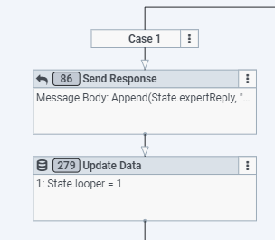

## Content
[toc]

## Implementing a support platform that delivers exceptional customer experience
The Genesys Cloud Developer Blueprint provides a simple example of implementing Limitless GigCX on Genesys Cloud [https://www.limitlesstech.com/genesys/](https://www.limitlesstech.com/genesys/ "Goes to the GigCX with Limitless and Genesys page") to manage and deliver expert customer support.

This blueprint demonstrates how to:

- Integrate Genesys Cloud and the Limitless GigCX SmartCrowd platform
- Use Genesys Cloud open messaging and chats
- Connect Limitless GigCX to your email channels
- Route a conversation to an expert crowd and facilitate the conversation between customer and GigCX expert
- Route to the appropriate Genesys Cloud agent if the expert crowd is unable to help
- Manage the lifecycle and status events from the SmartCrowd platform 

## Solution components

**Limitless GigCX** - A product your organization can use to quickly build a qualifier crowd of exports to resolve customer support tickets. The expert is available 24/7, in any language, to deliver amazing support at a significantly lower cost to serve. You can find out more about Limitless GigCX at: <https://www.limitlesstech.com/>

**Architect Flows** - A flow in Architect, a drag and drop web-based design tool, dictates how Genesys Cloud handles inbound or outbound interactions. 

## Prerequisites

### Specialized knowledge
- Compatible with web chat v1.1 & web chat v2
- Experience with Limitless GigCX
- Experience designing Architect flows

The following diagram shows a high-level representation of the implementation.

 

You can learn more about Limitless GigCX and Genesys at: [https://www.limitlesstech.com/genesys/](https://www.limitlesstech.com/genesys/ "Goes to the GigCX with Limitless and Genesys page").

# Implementation steps

## Connecting to Limitless GigCX SmartCrowd

Without connectivity to Limitless GigCX SmartCrowd, you cannot bring Experts into the conversation. The expert crowd uses the SmartCrowd platform to receive conversations and respond to them. The expert can do this via Web or Mobile App, and they receive rewards on a per task basis. Limitless GigCX operates a fully managed service for the expert crowd, so a Limitless GigCX client is required to connect to the platform and route tasks. This blueprint shows you how to achieve that for Genesys Cloud.

Steps to connectivity:

1. Contact Limitless GigCX and our friendly team to request a demo: [https://www.limitlesstech.com/request-a-demo/](https://www.limitlesstech.com/request-a-demo/ "Goes to the See Limitless GigCX in action page").

1. The Limitless GigCX team will provide the following:
   1. Your API Key (x-api-key)
   1. The Group Name for your implementation
   1. User Credentials so you can play the role of an expert in your Group on the SmartCrowd platform

The API key and Group Name are passed through to SmartCrowd via Data Actions, and these values enable you to submit questions and customer dialogues to Limitless GigCX.

## The data actions
We will use Data Actions to call the Limitless GigCX APIs. There are twelve data actions saved in this blueprint under the "Data Actions" subdirectory. Before importing the Data Actions, you should be sure to have both the "Web Services Data Actions" integration and the “Genesys Cloud Data Actions” installed and made active. For more information see, [About the web services data actions integration](https://help.mypurecloud.com/?p=127163 "Goes to the About the web services data actions integration article") in the Genesys Cloud Resource Center.

Now we import each of the twelve data actions. For more information see, [Import or export a data action for integrations](https://help.mypurecloud.c}om/?p=161024 "Goes to the Import or export a data action for integrations article") in the Genesys Cloud Resource Center.

Each data action connects to an API - some are Genesys Cloud APIs, and some are Limitless GigCX Web Services, as shown in the table below. For more information see, [https://developer.genesys.cloud/api/](https://developer.genesys.cloud/api/ "Goes to the APIs page").

The following are data actions to import:

|**Data Action Name**|**Integration**|**Genesys API**|**Used In**|**Purpose**|
| :-: | :-: | :-: | :-: | :-: |
|Limitless - Get Contact By Phone from Genesys v1|Genesys Cloud|/api/v2/externalcontacts/contacts?q=${input.phone}|- Open messaging flow|Looks up the customer in the Genesys External Contacts using the phone number. Returns the customers' First Name and first initial of their Last Name (this is used for personalisation of responses) Note: In your contact center you may be using a CRM for this information and should use your CRM API to get the customer details) |
|Limitless - Get Message Id Count from Genesys v1|Genesys Cloud|/api/v2/conversations/messages/${input.conversationId}|- Open messaging flow- Chat flow|Counts the number of messages authored by the customer for this Genesys Conversation. Used in logic to send additional customer dialogues to Limitless|
|Limitless - Get Last N Message Ids from Genesys v1|Genesys Cloud|/api/v2/conversations/messages/${input.conversationId}|- Open messaging flow|Returns the last N message ids of messages authored by the customer on this Genesys Conversation. Used in logic to send additional customer dialogues to Limitless|
|Limitless - Get Last Message from Genesys v1|Genesys Cloud|/api/v2/conversations/messages/${input.conversationId}/messages/${input.messageId}|- Open messaging flow|Returns the customer authored dialogue (e.g. message body) for a specific message so it can be sent to Limitless|
|Limitless - Get Message Ids From Chat Conv By Id from Genesys v1|Genesys Cloud|/api/v2/conversations/chats/${input.conversationId}/messages?sortOrder=${input.sortOrder}|- Chat flow|Get any new message ids from the chat, oldest first|
|Limitless - Get Message Ids From Chat Conv By Id And MsgId from Genesys v1|Genesys Cloud|/api/v2/conversations/chats/${input.conversationId}/messages?after=${input.messageId}&sortOrder=${input.sortOrder}|- Chat flow|Additionally searches with messageId/api/v2/conversations/chats/${input.conversationId}/messages?sortOrder=${input.sortOrder}vs./api/v2/conversations/chats/${input.conversationId}/messages?after=${input.messageId}&sortOrder=${input.sortOrder}
|Limitless - Push Question to SmartCrowd v1|Web Services|N/A| - Open messaging flow - Email flow- Chat flow |Submits the question/conversation to Limitless.|
|Limitless - Submit FollowUp Dialogue to SmartCrowd v1|Web Services|N/A| - Open messaging flow - Email Flow - Chat flow |Submits new customer authored dialogues to Limitless.|
|Limitless - Return from SmartCrowd v1|Web Services|N/A| - Open messaging flow - Chat flow |Tells SmartCrowd to close its message lifecycle as Genesys has brought an Agent into the conversation.|
|Limitless - Get Full Event from SmartCrowd v1|Web Services|N/A| - Open messaging flow - Email flow - Chat flow
|Retrieves expert dialogue and SmartCrowd Message Status events from the Limitless event queue.|
|Limitless Send Email Reply v1|Web Services|N/A|- Email flow|Send the expert response via email using an SMTP server.|
|Limitless - Shorten Link v1|Web Services|N/A| - Open messaging flow - Email flow - Chat flow |Used to call out to a 3rd Party url shortener to reduce the size of the CSAT link. The example url here is for Bitly: [Short links, big results](https://bitly.com/ "Goes to the Short links, big results page") and to use that service you will need a Bitly account and then to input your account specific token into the header. You can also replace Bitly with your url shortner of choice.|
After importing all the data actions, you will need to publish them to be used in our Architect flows.

## The architect flows

An Architect Flow is needed to send a customer question (from an incoming message) to Limitless GigCX. This blueprint contains the following flows:

- **Open messaging** - Connect Limitless GigCX to your open messaging channels
- **Chat** - Connect Limitless  GigCX to your web chat channels (**Note**: This flow is compatible with web chat v1.1 & web chat v2)
- **Email** - Connect Limitless GigCX to your email channels 

You can import these flows from the "Architect Flows" GUI. For more information see, [Import or export a flow](https://help.mypurecloud.com/?p=2730 "Goes to the the Import or export a flow article") in the Genesys Cloud Resource Center.

### Flow variables
For all flows, you will need to set the following flow variables. You can set these in the ***Resources>Data*** area of each flow. 

 

For more information see, [Manage a variable](https://help.mypurecloud.com/?p=109357 "Goes to the Manage a variable article") in the Genesys Cloud Resource Center.

|**Variable**|**Set to**|
| :-: | :-: |
|Flow.apikey|Your API key supplied by Limitless|
|Flow.stage|The target Limitless environment is being used by this flow. This value will be supplied by Limitless|
|Flow.EnterpriseName|Set this to the name of your Enterprise. This value will appear in some of the Send Response blocks within the flow.|
|Flow.GroupName|Set this to the Group Name value that Limitless provided to you|
|Flow.LoopMax|Set to the maximum number of loops you want the Flow to go through (See ‘Enter The Loop’ section). The default value is 90 and will see you through most implementations - consider changing this in only consultation with the Limitless team.|
|Flow.WaitSeconds| Set the wait time for the Loop you require (See ‘Enter The Loop’ section). The default value is 8 seconds and will see you through most implementations - consider changing this in only consultation with the Limitless team.|

### Flow states
Each flow has two states:

- **Starting state** - The Starting State represents a simple flow that engages Limitless GigCX by calling the Limitless GigCX expert state. Other than demos, you probably won’t use this Starting State as you will have your own flows that you wish to extend to the expert crowd.
- **Limitless Expert** - This state contains the connectivity and conversation lifecycle management when the conversation is handled by expert Crowd via the SmartCrowd platform. The logic contained in this state is described in more detail below, but you should only make changes here in consultation with the Limitless GigCX team. This state has been designed to drop it into your existing Genesys flows and bring the expert crowd into conversations where you wish.

### **The open messaging flow**
The oepn messaging flow connects Limitless GigCX to your open messaging channels.

#### Starting state
This state contains:

- ***A Send Response Block*** - Debugging information that confirms you are in the Limitless GigCX demo and the Genesys Message ID
- ***Switch Block***:
  - Case 1 - A simple example shows routing straight to an Agent rather than the GigCX Crowd
  - Case 2 - A simple example shows where automation/chatbot could be used
  - Case 3 - Shows routing to Limitless GigCX via the ‘Limitless Expert’ state

#### Limitless GigCX expert state
This state contains the connectivity and conversation lifecycle management when the conversation is handled by the expert crowd via the SmartCrowd platform.

##### Look up the customer
The Call Data Action is the first step in our "Limitless Expert" flow using the ‘Get Contact By Phone' action.

 

This block uses the customer’s phone number to retrieve the first name and first initial of their last name to include in the post of the question to Limitless. The customer's first name and first Initial of their last name are shared and can be seen by the expert crowd to aid the personalization of the expert response. In your contact center, you may be using a Customer Relationship Management (CRM) solution, and you can replace this data action with a call to your CRM to retrieve the required customer information. 

***An important note here on ‘Transfer to ACD’ blocks in the flow*** - An exception handling throughout the flow will send the conversation to an ‘Escalated’ queue via a ‘Transfer to ACD’ block. This ‘Escalated’ queue should be replaced with the agent queue you want conversations to go to if the ‘Limitless Expert' state hits a problem or if the expert crowd cannot help the customer.

 

##### Submit the question to Limitless
There is another Call Data Action using the ‘Limitless Push Question’ action. This action submits the customer's question to the Limitless GigCX SmartCrowd platform, and it becomes visible to expert in the GigCX Crowd. In the integration, the Genesys Conversation ID and Limitless GigCX Message ID are exchanged.

 

##### Enter the loop
After successfully submitting the customer question to Limitless GigCX, the ‘Limitless Expert’ flow prepares to enter a loop. The Loop itself performs two functions:

1. Monitor the customer side of the conversation - detecting and submitting additional customer dialogues to Limitless GigCX.
1. Monitor the Limitless side of the conversation - detecting and displaying expert dialogues to the customer and monitoring the Lifecycle state of the Limitless GigCX message within the SmartCrowd platform, and taking appropriate action based on these statuses.

By default, the Loop will execute 90 times with a wait time of 8 seconds. These values can be changed to adjust the customer experience in different messaging channels and scenarios - consider changing these values only in consultation with the Limitless GigCX team.

The flow does the following to prepare for entering the loop:

1. Attaches the Limitless GigCX Message ID to the Conversation - This is used to signify a conversation is ‘with Limitless’ GigCX and this association is removed later in the flow when the Limitless GigCX portion of the conversation is over.
1. Sets the customer message count to 1, signifying the question has been submitted, and this value is used within the loop to decide if additional customer dialogues need to be sent to Limitless GigCX.

 

##### The loop
At the start of each loop, the number of customer dialogues on the conversation is compared with the previous number at the start of the last loop. This is done by performing the Action: Get Message ID Count and the subsequent decision block.

 

If the number is now greater than the saved number, the loop moves to the customer Dialogue part to pick up and send  the additional customer dialogues to Limitless GigCX.

If the number is not greater than the saved number, the loop moves to the Limitless GigCX part to pick up and send expert dialogues and monitor the status of the message within SmartCrowd so appropriate actions can be taken within the conversation.

If neither the customer nor the expert presents dialogue, the Wait block is executed. This Wait keeps the loop from “running away” and reaching the LoopMax count too quickly. A smaller value in the WaitSeconds flow variable can make the whole experience more responsive. However, too small of a WaitSeconds value will cause the entire loop to complete too soon. Again, please consult with the Limitless GigCX team before altering these default values.

##### Customer dialogue side of the loop
This part of the Loop picks up additional customer dialogues to send to Limitless GigCX. It picks up the number of customer dialogues authored since the last send to Limitless and then loops through them, submitting each one to Limitless GigCX via the ‘Limitless Submit Follow Up Dialogue’ Data Action.

If the customer includes the word “Agent” then the loop uses a ‘Transfer to ACD” block to immediately bring in an agent. You would consider the logic you want here, if any. If this ‘Transfer to ACD’ block is triggered, and the agent is brought into the conversation, the Flow informs Limitless GigCX SmartCrowd via the 'Limitless Return’ Data Action. This ensures the conversation is closed on the Limitless GigCX side and removed from the expert.

 

##### Limitless side of the loop
This part of the Loop monitors a Limitless GigCX event queue for expert dialogues and Limitless GigCX status events that need to trigger specific actions in the conversation. This part of the Loop starts with retrieving the events from the queue via the ‘Limitless Get Full Event Prod’ Data Action. 

 

The subsequent Event Type block evaluates the following cases:

- ***Case 1*** - An expert dialogue event is detected via the Limitless GigCX update type = ‘dlg’. The expert dialogue is sent to the customer via a Send Response block

- ***Case 2*** - The expert has expressed an opinion they believe the conversation is complete and this event is detected via the Limitless GigCX update type = ‘cust\_confirmation’. If a CSAT hasn’t already been sent, then this event triggers a CSAT link (shortened via a data action) to be sent to the customer. 

- ***Case 3*** - A Limitless GigCX SmartCrowd status change event is detected via the Limitless GigCX update type = ‘state’. These status changes are further evaluated, and the following actions are performed:
  - ***‘Escalated’*** - The expert crowd has decided they cannot resolve this question. When this state is detected, the customer receives a message stating that an agent will be brought into the conversation, and a ‘Transfer to ACD’ block is used to bring in the agent.
  - ***‘TimedOut’*** - The expert crowd did not respond in time. When this state is detected, the customer receives a message stating that an agent will be brought into the conversation, and a ‘Transfer to ACD’ block is used to bring in the agent.
  - ***‘Open’ & Not ‘TimedOut’*** - The Limitless GigCX lifecycle is in a state where a CSAT, if not already issued, should be sent to the customer. The flow actions this.
  - ***‘Resolved’*** - The Limitless GigCX lifecycle was completed, and the question resolved. This is an end state, and the flow disconnects. 

### The chat flow
This connects Limitless GigCX to your web chat channels (note: This flow is compatible with web chat v1.1 & web chat v2)

#### Starting state
This begins by welcoming the customer and ensuring there is a customer message to acknowledge. 

 

Once established, the customers chat is routed to Limitless GigCX via a switch block:

- Case 1 - Shows example routing straight to an Agent rather than the GigCX Crowd
- Case 2 - Shows an example where automation/chatbot could be used
- Case 3 - Shows example routing to Limitless GigCX via the ‘Limitless Expert’ state

#### Limitless expert state
This contains the connectivity and conversation lifecycle management when the conversation is handled by an expert crowd via the SmartCrowd platform.

#### Submit the question to Limitless GigCX
There is a Call Data Action using the ‘Limitless Push Question’ action. This action submits the customer’s question to the Limitless GigCX SmartCrowd platform, and it becomes visible to the expert in the GigCX Crowd. The Genesys Conversation ID and Limitless GigCX Message ID are exchanged in the integration.

 

#### Enter The loop
After successfully submitting the customer question, the ‘Limitless Expert’ flow prepares to enter a loop. The Loop itself performs two functions:

1. MonitorS the customer side of the conversation - detecting and submitting additional customer dialogues to Limitless GigCX.
1. MonitorS the Limitless GigCX side of the conversation - detecting and displaying expert dialogues to the customer and monitoring the Lifecycle state of the Limitless GigCX message within the SmartCrowd platform, and taking appropriate action based on these statuses. 

By default, the Loop will execute 90 times with a wait time of 8 seconds. These values can be changed to adjust the customer experience in different messaging channels and scenarios - consider changing these values only when consulted with the Limitless GigCX team.

The flow does the following to prepare for entering the loop:

1. Attaches the Limitless GigCX Message ID to the Conversation - This signifies that a conversation is ‘with Limitless’, and this association is removed later in the flow when the Limitless GigCX portion of the conversation is over.
1. Sets the customer message count to 1, signifying that the question has been submitted to Limitless GigCX. This value is used within the loop to decide if additional customer dialogues need to be sent to Limitless GigCX.

#### The loop
During the loop's initial start, the number of customer dialogues on the conversation is compared to the last number at the beginning of the previous loop. The following action performs this: Get Message ID Count and the subsequent Decision block.

If the number is now greater than the saved number, the loop moves to the customer dialogue part to pick up and send the additional customer dialogues to Limitless GigCX.

If the number is not greater than the saved number, the loop moves to the Limitless GigCX part to pick up and send expert dialogues and monitor the status of the message within SmartCrowd so the appropriate actions can be taken within the conversation.

If the customer nor the expert presents dialogue, then the Wait block is executed. The Wait block keeps the loop from “running away” and reaching the LoopMax count too quickly. A smaller value in the WaitSeconds flow variable can make the whole experience more responsive.  However, too small of a WaitSeconds value will cause the entire loop to complete too soon.  Consult with the Limitless GigCX team before altering these default values.

 

##### Customer dialogue side of the loop
The customer dialogue picks up additional customer dialogues authored since the last delivery to Limitless GigCX. The loops then submit each to Limitless GigCX via the ‘Limitless Submit Follow Up Dialogue’ Data Action.

If the customer includes the word “Agent”, then the loop uses a ‘Transfer to ACD” block to immediately bring in an agent. Consider the logic, if the ‘Transfer to ACD’ block is triggered, and the agent is brought into the conversation, then the flow informs Limitless GigCX SmartCrowd via the 'Limitless GigCX Return’ data action. This ensures the conversation is closed on the Limitless GigCX side and removed from the expert.

 

##### Limitless side of the loop
The Limitless side of the loop monitors a Limitless GigCX event queue for expert dialogues and Limitless GigCX status events that need to trigger specific actions in the conversation. This part of the Loop starts with retrieving the events from the queue via the ‘Limitless Get Full Event Prod’ Data Action. 

 

Then, the subsequent event Type block evaluates the following cases:

- ***Case 1*** - An expert dialogue event is detected via the Limitless GigCX update type = ‘dlg’. The expert dialogue is sent to the customer via a Send Response block

- ***Case 2*** - The expert has expressed an opinion they believe the conversation is complete and this event is detected via the Limitless GigCX update type = ‘cust\_confirmation’. If a CSAT has not been sent, the event triggers a CSAT link (shortened via a data action) to send to the customer.

- ***Case 3*** - A Limitless GigCX SmartCrowd status change event is detected via the Limitless GigCX update type = ‘state’. These status changes are further evaluated, and the following actions are performed:
  - ***‘Escalated’*** - The expert crowd has decided they cannot resolve this question. When this is detected, the customer receives a message stating an Agent will be brought into the conversation, and a ‘Transfer to ACD’ block is used to bring in the agent.
  - ***‘TimedOut’*** - The expert crowd did not respond in time. When this state is detected, the customer receives a message stating an agent will be brought into the conversation, and a ‘Transfer to ACD’ block is used to bring in the agent.
  - ***‘Open’ & Not ‘TimedOut’*** - The Limitless GigCX lifecycle is in a state where a CSAT, if not already issued, should be sent to the customer. This is part of the action of the flow.
  - ***‘Resolved’*** - The Limitless GigCX lifecycle was completed, and the question resolved. This is an end state, and the flow disconnects.

### The email flow
The email flow connects Limitless GigCX to your email channels. 

#### Starting state

The Starting state contains:

- ***A Send Response Block*** - Debugging information confirming you are in the Limitless GigCX demo and the Genesys Message ID
- ***Switch***:
  - ***Case 1*** - Shows routing straight to an agent rather than the GigCX Crowd
  - ***Case 2*** - Shows where automation/chatbot could be used (Self help)
  - ***Case 3*** - Sends a follow-up message via the data action and the customer replies to the thread

- ***Default*** - Routes the original question to the expert. This part contains a Call Data Action using the ‘Limitless Push Question’. The action submits the customer’s question to the Limitless GigCX SmartCrowd platform, and it becomes visible to the expert in the GigCX Crowd. The Genesys Conversation ID and Limitless GigCX
Message ID are exchanged in the integration.

#### Limitless GigCX expert state
The Expert state contains the connectivity and conversation lifecycle management when the conversation is handled by expert Crowd via the SmartCrowd platform.

#### Enter The loop
After successfully submitting the customer question to Limitless GigCX, the ‘Limitless Expert’ flow prepares to enter a loop. The Loop performs one function, to monitor the Limitless GigCX side of the conversation - detecting and displaying expert dialogues to the customer and monitoring the Lifecycle state of the Limitless GigCX message within the SmartCrowd platform and taking the appropriate action based on these statuses.

 

By default, the loop will execute 90 times with a wait time of 8 seconds. These values can be changed to adjust the customer experience in different email channels and scenarios - consider changing these values only in consultation with the Limitless GigCX team.

To prepare for entering the loop, the flow attaches the Limitless GigCX Message ID to the Conversation - This is used to signify that a conversation is ‘with Limitless’, and this association is removed later in the flow when the Limitless GigCX portion of the conversation is over.

#### The loop
The loop picks up and sends expert dialogues and monitors the message's status within SmartCrowd so the appropriate actions are taken within the conversation.

If the expert presents a dialogue, then the Wait block is executed. This Wait keeps the loop from “running away” and reaching the LoopMax count too quickly. A smaller value in the WaitSeconds flow variable can make the whole experience more responsive. However, too small of a WaitSeconds value will cause the entire loop to complete too soon. Again, please consult with the Limitless GigCX team before altering these default values.

##### Monitoring Limitless
Monitoring Limitless observes the Limitless GigCX event queue for expert dialogues and Limitless GigCX status events required to trigger specific actions in the conversation. This part of the Loop starts with retrieving the events from the queue via the ‘Limitless GigCX Get Full Event Prod’ Data Action. The subsequent Event Type block then evaluates the following cases:

- ***Case 1*** - An expert dialogue event is detected via the Limitless GigCX update type = ‘dlg’. The expert dialogue is sent to the customer via a Send Response block

- ***Case 2*** - The expert has expressed an opinion they believe the conversation is complete and this event is detected via the Limitless GigCX update type = ‘cust\_confirmation’. If a CSAT has not been sent, then this event triggers a CSAT link (shortened via a data action) to be sent to the customer.

- ***Case 3*** - A Limitless GigCX SmartCrowd status change event is detected via the Limitless GigCX update type = ‘state’. These status changes are further evaluated, and the following actions are performed:
  - ***‘Escalated’*** - The expert crowd has decided they cannot resolve the question. When this state is detected, the customer receives a message stating an agent will be brought into the conversation, and a ‘Transfer to ACD’ block is used to bring in the agent.
  - ***‘TimedOut’*** - The expert crowd did not respond in time. When this state is detected, the customer receives a message stating an agent will be brought into the conversation, and a ‘Transfer to ACD’ block is used to bring in the agent.
  - ***‘Open’ & Not ‘TimedOut’*** - The Limitless GigCX lifecycle is in a state where a CSAT, if not already issued, should be sent to the customer. The flow actions this.
  - ***‘Resolved’*** - The Limitless GigCX lifecycle was completed, and the question resolved. This is an end state, and the flow disconnects.

:::primary
**Note**: The use of the Limitless GigCX flows has no impact on Cloud Analytics or reporting.
:::

## Other considerations
- ***Flow Outcomes*** - The blueprint does not contain flow Outcomes to avoid validation errors on import. You should consider what Flow Outcomes you want and introduce these to Flow.

## Additional resources
- [https://developer.genesys.cloud/api/](https://developer.genesys.cloud/api/ "Goes to the APIs page") in the Genesys Cloud Developer Center
- [https://github.com/GenesysCloudBlueprints/limitless-flows-blueprint](https://github.com/GenesysCloudBlueprints/limitless-flows-blueprint "Goes to the Limitless blueprint repository") in Github